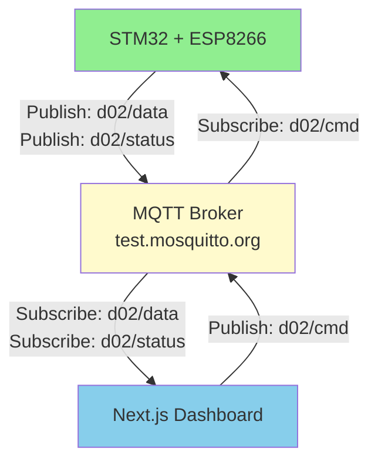

# MQTT Topics Reference

## Overview
This document lists all MQTT topics used in the irrigation system (d02).

---

## Topic Structure

All topics are prefixed with `d02/` to organize messages by device/project.



**Topics:**
- `d02/data` → Data sensor (STM32 publish, Dashboard subscribe)
- `d02/cmd` → Command (Dashboard publish, STM32 subscribe)
- `d02/status` → Status feedback (STM32 publish, Dashboard subscribe)

```
d02/
├── data        → Sensor telemetry (STM32 → Dashboard)
├── status      → Device status (STM32 → Dashboard)
└── cmd         → Pump commands (Dashboard → STM32)
```

---

## Topics Detail

### 1. `d02/data` (Telemetry Data)
**Direction:** STM32 → Dashboard  
**Purpose:** Send sensor readings to dashboard  
**Format:** BME280 comprehensive format

**Example Payload:**
```
BME: 25.1C, 1013hPa, 65% | Soil: 60%, 58%, 62% | Water: 35.5%, 40.2% | Pompa: ON, OFF | V1: ON | V2: OFF | V3: ON
```

**Parsed Data:**
- **BME280 Sensor**:
  - Temperature: `25.1°C`
  - Pressure: `1013 hPa`
  - Humidity: `65%`
- **Soil Moisture** (3 sensors): `60%, 58%, 62%` → Averaged to display
- **Water Level** (2 sensors): `35.5%, 40.2%` → Averaged to display
- **Pump Status**: `Pompa1: ON, Pompa2: OFF`
- **Valve Status**: `V1: ON, V2: OFF, V3: ON`

**Legacy Formats Supported:**
- `st=25,at=27,sh=65,ah=55,p=825,wl=18,c=1` (comprehensive)
- `P701_ST21_SH52_WL12_AT26_AH62_C1` (simple)
- JSON: `{"pressure":1013,"soilTemp":23,...}`

---

### 2. `d02/status` (Device Status)
**Direction:** STM32 → Dashboard  
**Purpose:** Report device health and uptime  
**Format:** Key-value pairs

**Example Payload:**
```
pump_irrigation=ON,pump_suction=OFF,timestamp=12345
```

**Parsed Data:**
- Irrigation pump state: `ON/OFF`
- Suction pump state: `ON/OFF`
- Timestamp: `milliseconds since boot`

---

### 3. `d02/cmd` (Pump Commands)
**Direction:** Dashboard → STM32  
**Purpose:** Control pumps remotely  
**Format:** Simple text command (uppercase)

**Commands:**

| Command | Action | LED State (PC13) | Description |
|---------|--------|------------------|-------------|
| `POMPA` | Irrigation ON | LOW (LED ON) | Turn on irrigation pump |
| `SEDOT` | Suction ON | HIGH (LED OFF) | Turn on suction pump |

**Example Payloads:**
```
POMPA
SEDOT
```

**Note:** Commands are case-insensitive in STM32 firmware, but dashboard sends uppercase.

---

## MQTT Broker Configuration

**Public Broker:** `test.mosquitto.org`

| Protocol | Port | Usage |
|----------|------|-------|
| MQTT (TCP) | 1883 | Python scripts, STM32 |
| WebSocket (WS) | 8080 | Next.js dashboard (HTTP) |
| WebSocket Secure (WSS) | 8081 | Next.js dashboard (HTTPS) |

**QoS Levels:**
- **QoS 1** (At least once) - Used for all messages to ensure delivery

---

## File Locations

### Next.js Dashboard
- **File:** `app/page.tsx`
- **Subscribes to:**
  - `d02/data` (sensor telemetry)
  - `d02/status` (pump status)
  - `test` (testing)
- **Publishes to:**
  - `d02/cmd` (pump commands)

### STM32 Firmware (ESP8266)
- **File:** `ESP8266/Core/Src/main.c`
- **Subscribes to:**
  - `d02/cmd` (pump commands)
- **Publishes to:**
  - `d02/data` (sensor readings)
  - `d02/status` (pump feedback)

### STM32 Firmware (wifiCCU)
- **File:** `wifiCCU/Core/Src/main.c`
- **Subscribes to:**
  - `d02/cmd` (pump commands)
- **Publishes to:**
  - `d02/data` (sensor readings)
  - `d02/status` (pump feedback)

### Python Test Scripts

#### test_shallot_mqtt.py
- **Publishes to:** `d02/data`
- **Purpose:** Simulate STM32 sensor data

#### test_pump_command.py
- **Publishes to:** `d02/cmd`
- **Purpose:** Test pump control without dashboard

---

## Testing Commands

### Test Sensor Data Publishing
```bash
python test_shallot_mqtt.py
```
Publishes sample sensor data to `d02/data`

### Test Pump Commands
```bash
python test_pump_command.py
```
Sends `POMPA` and `SEDOT` commands to `d02/cmd`

### Monitor All Topics (mosquitto_sub)
```bash
mosquitto_sub -h test.mosquitto.org -t "d02/#" -v
```

### Publish Test Command (mosquitto_pub)
```bash
mosquitto_pub -h test.mosquitto.org -t "d02/cmd" -m "POMPA"
mosquitto_pub -h test.mosquitto.org -t "d02/cmd" -m "SEDOT"
```

---

## Message Flow Diagram

```
┌─────────────────┐
│   Next.js       │
│   Dashboard     │
└────────┬────────┘
         │
         │ Subscribe: d02/data, d02/status
         │ Publish: d02/cmd
         │
         ↓
┌────────────────────────┐
│  test.mosquitto.org    │
│  MQTT Broker           │
│  (Public)              │
└────────┬───────────────┘
         │
         │ Subscribe: d02/cmd
         │ Publish: d02/data, d02/status
         │
         ↓
┌─────────────────┐
│   STM32F401     │
│   (Black Pill)  │
│   + ESP8266     │
└─────────────────┘
```

---

## Environment Variables

### Next.js (.env.local)
```env
NEXT_PUBLIC_MQTT_BROKER=ws://test.mosquitto.org:8080
NEXT_PUBLIC_MQTT_TOPIC=d02/data
```

### Python Scripts
```bash
export MQTT_BROKER=test.mosquitto.org
export MQTT_TOPIC=d02/data
```

---

## Security Notes

⚠️ **Important:** 
- Currently using **public broker** without authentication
- Anyone can publish/subscribe to these topics
- For production, use:
  - Private MQTT broker
  - Username/password authentication
  - TLS/SSL encryption
  - Unique device credentials

---

## Troubleshooting

### Dashboard not receiving data?
1. Check browser console for WebSocket connection errors
2. Verify MQTT broker URL (ws:// for HTTP, wss:// for HTTPS)
3. Test with mosquitto_sub: `mosquitto_sub -h test.mosquitto.org -t "d02/data" -v`

### STM32 not responding to commands?
1. Check serial monitor for subscription confirmation
2. Verify ESP8266 WiFi connection
3. Test with mosquitto_pub: `mosquitto_pub -h test.mosquitto.org -t "d02/cmd" -m "POMPA"`

### Messages not arriving?
1. Confirm QoS level is set (recommended: QoS 1)
2. Check topic spelling (case-sensitive!)
3. Verify broker connectivity on both ends

---

## Version History

| Version | Date | Changes |
|---------|------|---------|
| 1.0 | 2025-11-01 | Initial simplified topic structure (d02/data, d02/cmd, d02/status) |

---

## Related Documentation

- [MQTT Testing Guide](MQTT_TESTING_GUIDE.md)
- [Integration Guide](INTEGRATION_GUIDE.md)
- [Debugging Guide](DEBUGGING_GUIDE.md)
